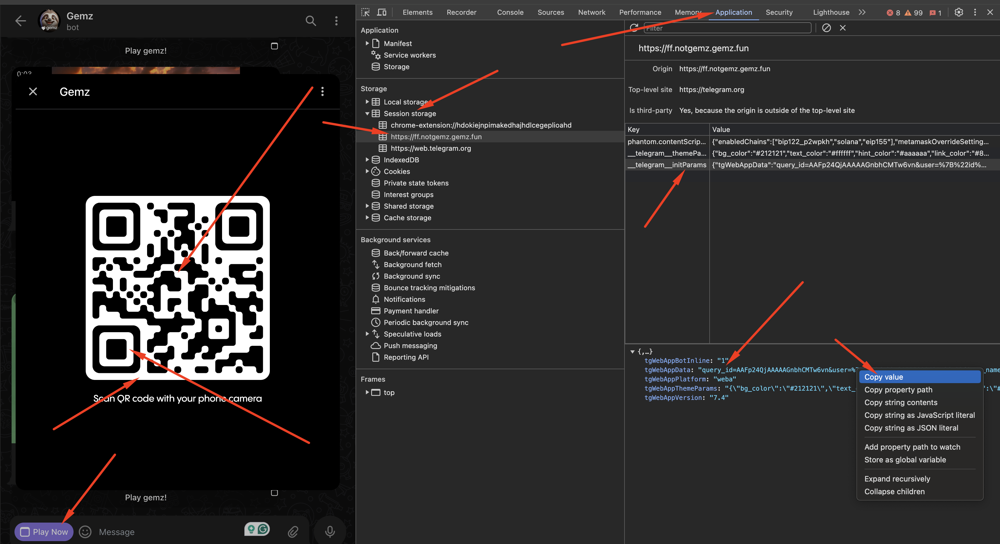

# How to Create and Fill `query.txt` with `query_id`

This guide provides step-by-step instructions on how to create a `query.txt` file and fill it with the `query_id` obtained from the session storage in Web Telegram.

## Steps to Follow:

### 1. Open Web Telegram

- Navigate to [Web Telegram](https://web.telegram.org/).

### 2. Open Developer Tools

- Press `F12` on your keyboard or right-click on the page and select `Inspect`.
- Alternatively, you can access it through your browser’s menu: `More tools > Developer tools`.

### 3. Go to the 'Application' Tab

- In the Developer Tools, find and click on the `Application` tab at the top.

### 4. Start the Bot

- Interact with your bot to initiate a session. This usually involves sending a command like `/start` to the bot.

### 5. Access the Session Storage

- In the `Application` tab, locate the `Storage` section on the left-hand side.
- Click on `Session Storage` and select the Web Telegram entry.

### 6. Locate the `query_id`

- Look for an entry related to `query_id` in the session storage list.
- Check for keys or values that contain `query` or similar terms. Refer to the screenshot you provided for more details.

### 7. Create and Fill `query.txt`

- Open your preferred text editor.
- Create a new file named `query.txt`.
- Copy the `query_id` you found in step 6 and paste it into this file.
- Save the file.

### Example `query.txt` File

```txt
query_id=AAFp24QjBBBBBBBGnbhCMPl2ic&user=%7B%22id%22%3A595123123%2C%22first_name%22%3A%22TTest%22%2C%22last_name%22%3A%22%22%2C%22username%22%3A%22mu_user_name%22%2C%22language_code%22%3A%22en%22%2C%22allows_write_to_pm%22%3Atrue%7D&auth_date=1720004644&hash=17254717cee123123123e789cfac828062123123123fc3df090f8cc6609c3e
````

